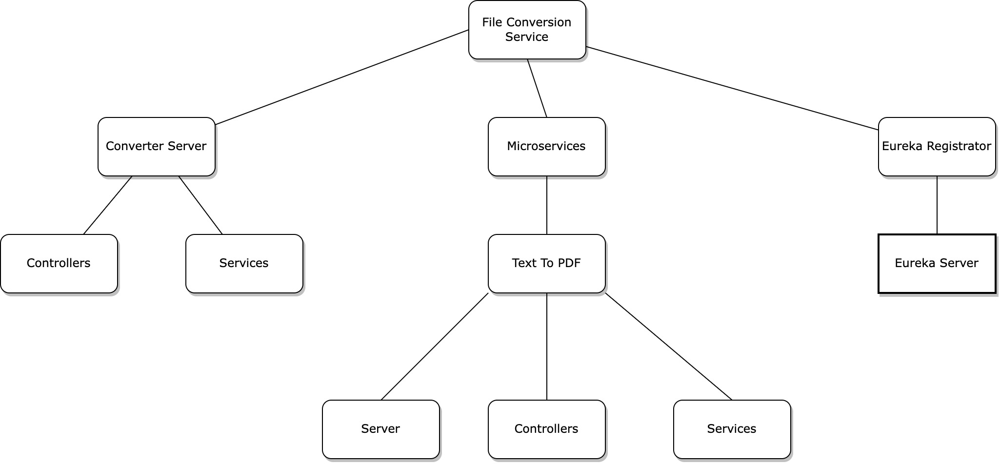
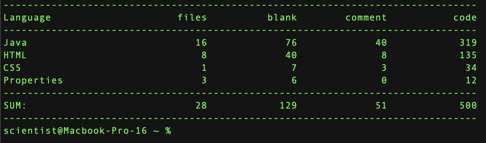

# Microservices Based File Converter
In this project several technologies will enable the creation of an application that will allow for independent microservices to handle file conversion. These will coordinate initially with a Netflix Eureka server and then be Dockerized and managed by Kubernetes.

## Run Instructions
1. Initialize the Eureka server.
2. Initialize the microservices.
3.  Initialize the web server. (if at this point the server fails to serve results, HTTP Error 500 may occur and exception of type: no instance of 'x' microservice running will be thrown).
4. Open all web pages through the ports provided from Eureka (Eureka is at port 8761).

## Software Architecture

## Technologies
- Java 18
- Netflix Eureka
- SpringBoot Framework
- Thymeleaf Templating Language
- Docker (not yet integrated)
- Kubernetes (not yet integrated)
- Intellij IDEA

## Lines of Code Analysis
Performed using the CLOC CLI tool.
